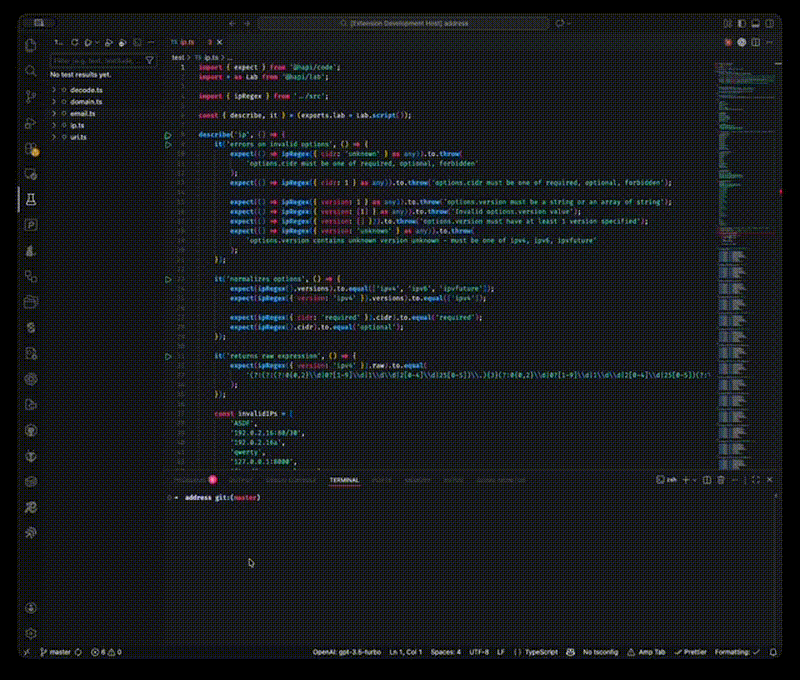

<p align="center">
  
</p>

<h1 align="center">hapi/lab Test Runner for VS Code</h1>

<p align="center">
  Run and debug <a href="https://hapi.dev/module/lab/">@hapi/lab</a> tests directly from VS Code's native Test Explorer
</p>

<p align="center">
  <a href="https://marketplace.visualstudio.com/items?itemName=mtharrison.vscode-lab-test-runner"></a>
  <a href="https://marketplace.visualstudio.com/items?itemName=mtharrison.vscode-lab-test-runner"></a>
  <a href="https://marketplace.visualstudio.com/items?itemName=mtharrison.vscode-lab-test-runner"></a>
  <a href="https://github.com/mtharrison/vscode-lab"></a>
  
  <a href="LICENSE"></a>
</p>

---

## See it in Action

<p align="center">
  
</p>

---

## Features

- **Native Test Explorer Integration** - Tests appear in VS Code's Test Explorer sidebar with green play arrows in the gutter
- **Run Individual Tests** - Click the play button next to any `test()`, `it()`, `describe()`, or `experiment()` block
- **Run All Tests** - Run entire test files or all tests at once from the Test Explorer panel
- **Live Results** - See test pass/fail status with colored ANSI output directly in the Test Results panel
- **Real-time Discovery** - Tests are automatically discovered and updated as you edit your files
- **Source Map Support** - Debug your tests with full source map support

---

## Quick Start

1. Install the extension from the [VS Code Marketplace](https://marketplace.visualstudio.com/items?itemName=mtharrison.vscode-lab-test-runner)
2. Open a project that uses `@hapi/lab` for testing
3. Open the Test Explorer in the sidebar (beaker icon) or press `Cmd+Shift+P` and type "Testing: Focus on Test Explorer View"
4. Your tests will be automatically discovered - look for green play buttons in the gutter
5. Click the play button next to any test to run it

---

## Requirements

- **Node.js** 18 or later
- **VS Code** 1.85.0 or later
- A project using `@hapi/lab` for testing

---

## Installation

### From VS Code Marketplace

Search for "hapi/lab Test Runner" in the VS Code Extensions marketplace, or [install directly](https://marketplace.visualstudio.com/items?itemName=mtharrison.vscode-lab-test-runner).

### From Command Line

```bash
code --install-extension mtharrison.vscode-lab-test-runner
```

### Manual Installation

1. Download the `.vsix` file from the [releases page](https://github.com/mtharrison/vscode-lab/releases)
2. In VS Code, go to Extensions (`Cmd+Shift+X`)
3. Click the `...` menu and select "Install from VSIX..."
4. Select the downloaded file

---

## Configuration

Configure the extension through VS Code settings (`Cmd+,` or `Ctrl+,`):

| Setting | Default | Description |
|---------|---------|-------------|
| `labTestExplorer.testMatch` | `**/{test,tests,__tests__}/**/*.{js,ts}` | Glob pattern to match test files |
| `labTestExplorer.labPath` | `""` | Path to lab executable (leave empty to use npx) |
| `labTestExplorer.timeout` | `30000` | Test timeout in milliseconds |
| `labTestExplorer.labArgs` | `--no-lint --no-coverage --no-leaks -v -r console` | CLI arguments to pass to lab |
| `labTestExplorer.commandPrefix` | `""` | Command prefix for running tests (e.g., `NODE_ENV=test`) |
| `labTestExplorer.activationCommand` | `""` | Shell command to run when extension activates |
| `labTestExplorer.suppressPrefixOutput` | `true` | Suppress output from commandPrefix wrapper |

### Example Settings

```json
{
  "labTestExplorer.testMatch": "**/test/**/*.test.ts",
  "labTestExplorer.timeout": 60000,
  "labTestExplorer.commandPrefix": "NODE_ENV=test",
  "labTestExplorer.labArgs": "--no-lint --no-coverage -v -r console"
}
```

### Advanced: Using a Command Prefix

The `commandPrefix` setting is useful for:
- Setting environment variables: `NODE_ENV=test`
- Using wrapper scripts: `./scripts/test-wrapper.sh --`
- Running with specific Node options: `node --inspect --`

---

## Usage

### Running Tests

**From the Gutter:**
- Click the green play button that appears next to any `test()`, `it()`, `describe()`, or `experiment()` block

**From the Test Explorer:**
1. Open the Test Explorer panel (beaker icon in the sidebar)
2. Expand the test tree to see individual tests
3. Click the play button next to any test or test file
4. Use the "Run All Tests" button to run everything

**From the Command Palette:**
- Press `Cmd+Shift+P` and type "Test: Run All Tests"

### Viewing Results

| Icon | Meaning |
|------|---------|
| Green checkmark | Test passed |
| Red X | Test failed |
| Yellow clock | Test is running |

Test output appears in the "Test Results" panel with colored output for easy reading.

### Debugging Tests

1. Set breakpoints in your test files
2. Use VS Code's built-in debugger with the "Debug Test" option
3. Step through your code with full source map support

### Refreshing Tests

- Click the refresh button in the Test Explorer toolbar
- Run the command "hapi/lab Test Runner: Refresh" from the Command Palette

---

## Troubleshooting

### Tests Not Appearing

1. Ensure your test files match the `labTestExplorer.testMatch` glob pattern
2. Check that `@hapi/lab` is installed in your project
3. Verify your test files use `test()`, `it()`, `describe()`, or `experiment()` functions

### Tests Failing to Run

1. Check the "Output" panel for error messages (select "hapi/lab Test Runner" from the dropdown)
2. Ensure `npx lab` works from your project root
3. Try setting an explicit `labTestExplorer.labPath` if you have a non-standard setup

### Slow Test Discovery

1. Narrow down the `labTestExplorer.testMatch` pattern to be more specific
2. Ensure `node_modules` is not being scanned (it's excluded by default)

---

## Development

```bash
npm install          # Install dependencies
npm run compile      # Compile TypeScript
npm run watch        # Watch for changes during development
npm test             # Run tests
npm run test:watch   # Run tests in watch mode
npm run test:coverage # Run tests with coverage
npm run lint         # Lint code
npm run lint:fix     # Lint and auto-fix issues
npm run package      # Package extension for production
npm run vsce:package # Create .vsix file for distribution
```

---

## Contributing

Contributions are welcome! Please feel free to submit a Pull Request.

---

## License

[BSD-3-Clause](LICENSE)
